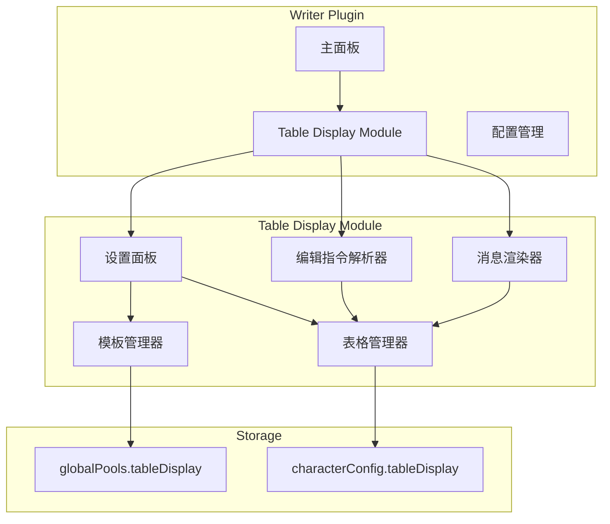
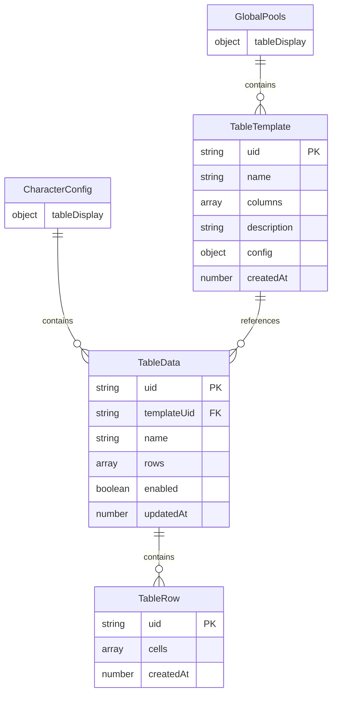

# 设计文档

## 概述

表格展示模块（Table Display Module）是 writer 插件的子模块，用于展示和管理表格数据。该模块从 st-memory-enhancement 的表格系统中提取核心功能，简化为纯展示用途，不进行记忆注入到 AI 上下文。

模块采用与 writer 现有模块一致的架构模式：
- 使用 IIFE 封装，挂载到 `window.WBAP` 命名空间
- 配置存储分为全局配置（模板）和角色配置（内容）
- UI 采用模态框设计，与现有模块风格一致

## 架构



## 组件与接口

### 1. 核心模块结构 (modules/table_display.js)

```javascript
// 模块主入口
(function () {
    'use strict';
    
    window.WBAP = window.WBAP || {};
    const Logger = WBAP.Logger || console;
    const TAG = '[TableDisplay]';
    
    // 模块状态
    const state = {
        initialized: false,
        elements: {},
        currentEditingTable: null
    };
    
    // 公开 API
    WBAP.TableDisplay = {
        init,
        openSettings,
        parseEditInstructions,
        renderTableInMessage,
        getConfig,
        getTemplates,
        getTables
    };
})();
```

### 2. 模板管理器 (TemplateManager)

负责表格模板的导入、存储和管理。

```javascript
interface TableTemplate {
    uid: string;              // 唯一标识符
    name: string;             // 模板名称
    columns: string[];        // 列名数组
    description?: string;     // 模板描述
    config: {
        note?: string;        // 表格说明
        insertNode?: string;  // 插入触发条件
        updateNode?: string;  // 更新触发条件
        deleteNode?: string;  // 删除触发条件
    };
    createdAt: number;        // 创建时间戳
}

// 模板管理 API
function importTemplate(jsonString: string): TableTemplate | null;
function exportTemplate(templateUid: string): string;
function deleteTemplate(templateUid: string): boolean;
function getTemplates(): TableTemplate[];
function getTemplateByUid(uid: string): TableTemplate | null;
```

### 3. 表格管理器 (TableManager)

负责表格内容的 CRUD 操作。

```javascript
interface TableData {
    uid: string;              // 唯一标识符
    templateUid: string;      // 关联的模板 UID
    name: string;             // 表格名称（可覆盖模板名称）
    rows: TableRow[];         // 数据行
    enabled: boolean;         // 是否启用
    updatedAt: number;        // 最后更新时间戳
}

interface TableRow {
    uid: string;              // 行唯一标识符
    cells: string[];          // 单元格值数组
    createdAt: number;        // 创建时间戳
}

// 表格管理 API
function createTable(templateUid: string): TableData;
function deleteTable(tableUid: string): boolean;
function getTable(tableUid: string): TableData | null;
function getTables(): TableData[];
function insertRow(tableUid: string, rowData: Record<number, string>): TableRow;
function updateRow(tableUid: string, rowIndex: number, rowData: Record<number, string>): boolean;
function deleteRow(tableUid: string, rowIndex: number): boolean;
function updateCell(tableUid: string, rowIndex: number, colIndex: number, value: string): boolean;
```

### 4. 编辑指令解析器 (EditParser)

从 AI 回复中提取和解析表格编辑指令。

```javascript
interface EditInstruction {
    type: 'insert' | 'update' | 'delete';
    tableIndex: number;       // 表格索引
    rowIndex?: number;        // 行索引（update/delete 需要）
    data?: Record<number, string>;  // 单元格数据
}

// 解析 API
function extractTableEditTag(message: string, tagName: string): {
    content: string;          // 正文内容
    editString: string;       // 编辑指令字符串
};
function parseEditInstructions(editString: string): EditInstruction[];
function executeInstructions(instructions: EditInstruction[]): boolean;
```

### 5. 消息渲染器 (MessageRenderer)

在 AI 回复底部渲染表格状态。

```javascript
interface RenderOptions {
    collapsed: boolean;       // 是否折叠
    activeTab: string | null; // 当前激活的表格 tab
}

// 渲染 API
function renderTableArea(messageId: number): HTMLElement;
function updateTableArea(messageId: number): void;
function toggleCollapse(messageId: number): void;
function switchTab(messageId: number, tableUid: string): void;
```

### 6. 配置结构

```javascript
// 全局配置 (mainConfig.globalPools.tableDisplay)
interface GlobalTableDisplayConfig {
    templates: TableTemplate[];
    apiConfig: {
        apiUrl: string;
        apiKey: string;
        model: string;
        maxTokens: number;
        temperature: number;
        timeout: number;
    };
}

// 角色配置 (characterConfig.tableDisplay)
interface CharacterTableDisplayConfig {
    enabled: boolean;
    tables: TableData[];
    extractTag: string;       // 提取标签，默认 'content'
    renderInMessage: boolean; // 是否在消息底部渲染
}
```

## 数据模型

### 存储结构



### 编辑指令格式

支持 st-memory-enhancement 格式的编辑指令：

```
<tableEdit>
<!--
insertRow(tableIndex, {colIndex: value, ...})
updateRow(tableIndex, rowIndex, {colIndex: value, ...})
deleteRow(tableIndex, rowIndex)
-->
</tableEdit>
```

示例：
```
<tableEdit>
<!--
insertRow(0, {"0":"角色A","1":"描述内容","2":"属性值"})
updateRow(1, 2, {"1":"更新后的描述"})
deleteRow(0, 5)
-->
</tableEdit>
```

## 正确性属性

*正确性属性是指在系统所有有效执行中都应保持为真的特征或行为——本质上是关于系统应该做什么的形式化陈述。属性作为人类可读规范和机器可验证正确性保证之间的桥梁。*


### Property 1: 模板导入往返一致性

*对于任意* 有效的 st-memory-enhancement 格式表格模板 JSON，导入后再导出应产生等价的模板数据（uid 除外）。

**验证: 需求 3.1, 3.2, 3.5**

### Property 2: 无效模板拒绝

*对于任意* 不符合 st-memory-enhancement 模板规范的 JSON 字符串，导入操作应返回 null 或抛出错误，且不修改现有模板列表。

**验证: 需求 3.3, 3.4**

### Property 3: 存储位置正确性

*对于任意* 模板和表格数据操作，模板应存储在 globalPools.tableDisplay.templates 中，表格内容应存储在 characterConfig.tableDisplay.tables 中。

**验证: 需求 4.1, 4.2**

### Property 4: 角色切换数据隔离

*对于任意* 两个不同角色，切换角色后加载的表格数据应与该角色之前保存的数据一致，不应混淆不同角色的数据。

**验证: 需求 4.3**

### Property 5: 表格编辑往返一致性

*对于任意* 表格和有效的编辑操作（添加行、删除行、修改单元格），执行操作后保存，再重新加载，表格数据应与操作后的状态一致。

**验证: 需求 5.3, 5.4, 5.5**

### Property 6: 标签提取正确性

*对于任意* 包含 `<tagName>...</tagName>` 和 `<tableEdit>...</tableEdit>` 的消息文本，提取函数应正确分离正文内容和编辑指令字符串。

**验证: 需求 6.2**

### Property 7: 编辑指令解析正确性

*对于任意* 符合 st-memory-enhancement 格式的编辑指令字符串（包含 insertRow、updateRow、deleteRow），解析函数应返回正确的指令对象数组。

**验证: 需求 6.3**

### Property 8: 编辑指令执行正确性

*对于任意* 有效的编辑指令和初始表格状态：
- insertRow 执行后，表格行数增加 1，新行数据与指令参数一致
- updateRow 执行后，指定行的指定单元格值与指令参数一致
- deleteRow 执行后，表格行数减少 1，指定行被移除

**验证: 需求 6.4, 6.5, 6.6**

### Property 9: 无效指令容错性

*对于任意* 格式无效的编辑指令字符串，解析和执行过程应忽略无效指令，不影响有效指令的执行，且不导致程序崩溃。

**验证: 需求 6.7**

### Property 10: 模块禁用数据保留

*对于任意* 已有表格数据的角色，禁用模块后再启用，表格数据应保持不变。

**验证: 需求 8.2, 8.3, 8.4**

## 错误处理

### 模板导入错误

| 错误场景 | 处理方式 |
|---------|---------|
| JSON 解析失败 | 显示 "JSON 格式无效" 错误提示，返回 null |
| 缺少必要字段（name/columns） | 显示 "模板格式不完整" 错误提示，返回 null |
| columns 不是数组 | 显示 "列定义格式错误" 错误提示，返回 null |
| 模板 UID 冲突 | 生成新的 UID，覆盖导入 |

### 编辑指令错误

| 错误场景 | 处理方式 |
|---------|---------|
| 指令格式无法解析 | 记录警告日志，跳过该指令 |
| tableIndex 超出范围 | 记录警告日志，跳过该指令 |
| rowIndex 超出范围（update/delete） | 记录警告日志，跳过该指令 |
| data 参数格式错误 | 记录警告日志，跳过该指令 |

### 存储错误

| 错误场景 | 处理方式 |
|---------|---------|
| 配置保存失败 | 显示错误提示，保留内存中的数据 |
| 配置加载失败 | 使用默认配置，显示警告提示 |

## 测试策略

### 单元测试

单元测试用于验证具体示例和边界情况：

1. **模板管理器测试**
   - 导入有效模板的具体示例
   - 导入无效 JSON 的边界情况
   - 模板删除和更新操作

2. **编辑指令解析器测试**
   - 解析单条指令的具体示例
   - 解析多条混合指令
   - 处理格式错误指令的边界情况

3. **表格管理器测试**
   - 创建表格的具体示例
   - 行操作（增删改）的边界情况
   - 空表格处理

### 属性测试

属性测试用于验证通用属性，使用 fast-check 库：

1. **模板往返测试** (Property 1)
   - 生成随机有效模板数据
   - 验证导入-导出往返一致性
   - 最少 100 次迭代

2. **指令解析测试** (Property 7)
   - 生成随机有效编辑指令
   - 验证解析结果正确性
   - 最少 100 次迭代

3. **指令执行测试** (Property 8)
   - 生成随机表格状态和编辑指令
   - 验证执行后状态正确性
   - 最少 100 次迭代

4. **数据隔离测试** (Property 4)
   - 生成随机角色配置
   - 验证切换后数据隔离
   - 最少 100 次迭代

### 测试配置

```javascript
// vitest.config.js 中的属性测试配置
export default {
    test: {
        // 属性测试最少 100 次迭代
        fuzz: {
            numRuns: 100
        }
    }
};
```

### 测试标签格式

每个属性测试必须包含注释引用设计文档属性：

```javascript
// Feature: table-display-module, Property 1: 模板导入往返一致性
test.prop('template import roundtrip', [validTemplateArb], (template) => {
    // ...
});
```
